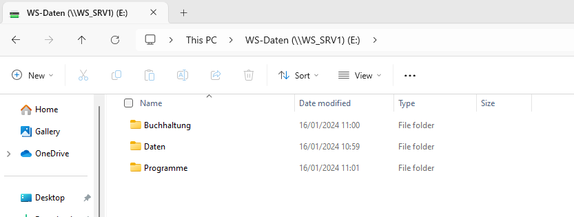

# Inhaltsverzeichnis {#inhaltsverzeichnis .TOC-Heading}

[1. Einführung [2](#einführung)](#einführung)

[1.1 Einführung mit Zielsetzung
[2](#einführung-mit-zielsetzung)](#einführung-mit-zielsetzung)

[2. Organisation [2](#organisation)](#organisation)

[2.1 Betriebsphilosophie
[2](#betriebsphilosophie)](#betriebsphilosophie)

[2.2 Verantwortlichkeiten
[2](#verantwortlichkeiten)](#verantwortlichkeiten)

[3. Bestehende Infrastruktur
[3](#bestehende-infrastruktur)](#bestehende-infrastruktur)

[3.1 Lokalitäten [3](#lokalitäten)](#lokalitäten)

[3.2 Systeme [3](#systeme)](#systeme)

[3.2.1 Netzwerke [3](#netzwerke)](#netzwerke)

[3.2.2 Computerhardware [3](#computerhardware)](#computerhardware)

[3.3 Software [3](#software)](#software)

[4. Definitive Erweiterungen
[4](#definitive-erweiterungen)](#definitive-erweiterungen)

[4.1 Technische Beschreibung der Systeme
[4](#technische-beschreibung-der-systeme)](#technische-beschreibung-der-systeme)

[4.2 Betriebssysteme [4](#betriebssysteme)](#betriebssysteme)

[4.3 Speichersysteme [7](#speichersysteme)](#speichersysteme)

[4.4 Anwendersoftware [9](#anwendersoftware)](#anwendersoftware)

[4.5 Logischer Netzwerkplan
[9](#logischer-netzwerkplan)](#logischer-netzwerkplan)

[5. Systemverwaltung [10](#systemverwaltung)](#systemverwaltung)

[5.1 Der Zugang zum System
[10](#der-zugang-zum-system)](#der-zugang-zum-system)

[5.2 Verzeichnis-, Rechte- und Benutzerstrukturen
[10](#verzeichnis--rechte--und-benutzerstrukturen)](#verzeichnis--rechte--und-benutzerstrukturen)

[5.3 Dateiablage [11](#dateiablage)](#dateiablage)

[5.4 Aktualisierung der Systeme
[11](#aktualisierung-der-systeme)](#aktualisierung-der-systeme)

[9. Datensicherung [12](#datensicherung)](#datensicherung)

[9.1 Mögliche Ursachen, die zum Datenverlust führen
[12](#mögliche-ursachen-die-zum-datenverlust-führen)](#mögliche-ursachen-die-zum-datenverlust-führen)

[9.2 Art der Datensicherung
[12](#art-der-datensicherung)](#art-der-datensicherung)

[9.2.1 Shadow Copies [13](#shadow-copies)](#shadow-copies)

[9.2.2 Windows Server Backup
[14](#windows-server-backup)](#windows-server-backup)

[9.2.3 Cloud Backup mit Acronis
[17](#cloud-backup-mit-acronis)](#cloud-backup-mit-acronis)

[9.2.4 Vorteile einer Automatisierung
[21](#vorteile-einer-automatisierung)](#vorteile-einer-automatisierung)

[9.3 Daten, die gesichert werden
[22](#daten-die-gesichert-werden)](#daten-die-gesichert-werden)

[9.4 Regelung zur Wiederherstellung von Datenbeständen
[22](#regelung-zur-wiederherstellung-von-datenbeständen)](#regelung-zur-wiederherstellung-von-datenbeständen)

[9.4.1 Disaster Recovery -- Testszenario
[23](#disaster-recovery-testszenario)](#disaster-recovery-testszenario)

[10. Qualitätskontrolle [28](#qualitätskontrolle)](#qualitätskontrolle)

[10.1 Datenschutzbestimmungen
[28](#datenschutzbestimmungen)](#datenschutzbestimmungen)

[10.2 Geschäftsbücherverordnung
[29](#geschäftsbücherverordnung)](#geschäftsbücherverordnung)

# 1. Einführung

## 1.1 Einführung mit Zielsetzung

In diesem Dokument soll es darum gehen, ein Konzept für den Betrieb
«WhiteSpace» aufzustellen. Das Unternehmen hat momentan sehr veraltete
IT-Strukturen, welche nicht den neusten Standards entsprechen. Vorerst
geht es daher darum, einen IST-Zustand der Systeme aufzuzeigen. In einem
weiteren Schritt werden die Anforderungen an diese Systeme geprüft,
aktualisiert und mit dem Auftraggeber abgeglichen, um schlussendlich
einen definitiven SOLL-Zustand zu erreichen.

Während der Umsetzung des Projekts geht es dabei in erster Linie darum,
die sicherheitsrelevanten Aspekte des finalen Systems abzudecken und zu
erfüllen. Im Vordergrund steht dabei das Thema Datenverlust, welches
eindeutig ein sehr aktuelles Thema ist. Wöchentlich hört man von
Grossfirmen aus aller Welt, dass sie damit zu kämpfen haben und bei
Datenverlust oder Ransomware Attacken mit unglaublich hohen Geldsummen
konfrontiert sind, um wieder an ihre Daten zu kommen, resp. den
Betriebsunterbruch zu kompensieren. Um bei diesem Projekt gegen ein
solchen Szenario vorbereitet zu sein, habe ich ein intelligentes
Backup-Konzept ausgearbeitet, welches auch den Hauptbestandteil des
Projekts ausmachen wird.

Insgesamt soll mit dieser Dokumentation aufgezeigt werden, wie ein
typisches KMU in der Schweiz aufgebaut sein könnte und wie sich dieses,
auch mit weniger Budget, erfolgreich gegen Datenverlust schützt.

# 2. Organisation

## 2.1 Betriebsphilosophie

Die Firma «WhiteSpace» ist ein kleines Gipser-Unternehmen mit einem
Geschäftsführer und 3 Mitarbeitern. Der CEO, Peter Meier, ist unser
Auftraggeber, mit ihm wird das ganze Projekt geplant. Während der Arbeit
möchte er sich wenig mit der IT beschäftigen müssen, da die Koordination
seiner Mitarbeiter sehr zeitintensiv ist und er gerne dort seine
Prioritäten setzen möchte.

Für seine neue IT-Infrastruktur wünscht sich Herr Meier daher, dass
diese einfach zu bedienen ist und die wichtigsten Tools sofort zu
Verfügung stehen. Dabei möchte er das System von der Geschäftsstelle
verwalten können und auf seine produktiven Daten zugreifen können. Seine
eigenen IT-Kenntnisse halten sich dabei klein, da er seit Jahren in der
Gipser-Branche verankert ist und dort die technische Entwicklung sehr
langsam von sich geht. So besteht seine jetzige IT-Infrastruktur einzig
und allein aus einem Laptop, welches er für jegliche organisatorische
Arbeit braucht.

Insgesamt möchte Herr Meier seine technischen Systeme so weit ausbauen,
dass er sich in den kommenden Jahren wenig darum kümmern muss und ihm
die alltägliche Arbeit erleichtert wird.

Peter Meier ist «old fashioned» unterwegs. Er will seine Daten unbedingt
noch vor Ort auf einem Server gespeichert haben, kann sich aber
vorstellen, die Cloud zukünftig selektiv für einzelne Anwendungen oder
Tools zu nutzen.

## 2.2 Verantwortlichkeiten

Die Verantwortlichkeiten sollen, gemäss Auftraggeber, besonders beim
IT-Admin liegen. So soll die komplette Serververwaltung beim
Administrator abgehandelt werden. Dazu gehören auch jegliche
File-Shares, auf welchen die produktiven Daten gespeichert werden
sollen. Im Zusammenhang damit liegt auch die Verwaltung der Backup
Daten, welche lokal wie auch in der Cloud gespeichert werden.
Schlussendlich hat der IT-Verantwortliche den Auftrag, alle produktiven
Systeme am Laufen zu halten und diese so sicher wie möglich zu halten,
bei Ausfällen hat der Admin den Auftrag, die Systeme schnellstmöglich
erneut zur Verfügung zu stellen.

Insgesamt soll so die Verantwortung der zentralen Verwaltung komplett
bei der IT-Abteilung liegen. Herr Meier selbst möchte nur Zugriff auf
seinen Laptop und die verknüpften File-Shares des Servers erhalten, da
er dort die produktiven Daten ablegt. Berücksichtigt wird hierbei das
geringe IT-Fachwissen von Herr Meier und so möchte er nur die nötigsten
Berechtigungen erhalten. Seine lokalen Daten auf dem Notebook möchte er
so weit selbst verwalten können, dass sie kein Sicherheitsrisiko für den
Betrieb darstellen. Da er dort nur nicht-produktive Daten speichert,
fallen sie aus der Verantwortung des Admins, die Abmachung zwischen dem
IT-Verantwortlichen und dem Auftraggeber soll klar lauten, dass
produktive Daten nur auf den zentralen File-Shares des Servers
gespeichert werden sollen, unter anderem auch, weil aus Kostengründen
keine Backups der lokalen Daten des Clients vorgesehen sind.

Seinen Mitarbeitenden möchte Herr Meier keinen Zugriff geben, da sie im
Alltagsgeschäft nicht darauf angewiesen sind. So kann der CEO volle
Verantwortung übernehmen und muss seine Mitarbeiter nicht unnötig
auslasten, er hat die volle administrative Kontrolle.

# 3. Bestehende Infrastruktur

## 3.1 Lokalitäten

Die für die IT relevante Geschäftsstelle des Gipser-Unternehmen befindet
sich gleich ausserhalb von Zürich an folgender Adresse:

Morgentalstrasse 4, 8108 Dällikon

Die Räumlichkeiten des Standortes halten sich beschränkt. Herr Meier hat
einen kleinen Empfangsbereich eingerichtet, welcher direkt am Eingang
des Büros liegt. Gleich dahinter befindet sich der Arbeitsbereich von
Herr Meier, wo er die meiste Zeit verbringt. Zusätzlich hat er einen
kleinen Archivraum mit direktem, verschliessbarem Zugang zu seinem
Arbeitsplatz.

## 3.2 Systeme

Folgend wird kurz auf die vorhandenen Systeme an der Geschäftsstelle
eingegangen. So können wir einen IST-Zustand des aktuellen
Kundenstandorts aufzeigen, welche für unsere spätere Planung sehr
wichtig sein wird.

###  3.2.1 Netzwerke

Die vorhandenen Netzwerke bestehen momentan aus einem Router, welcher
Herr Meier für die Arbeit mit seinem Laptop braucht. Der Router ist ein
handelsüblicher Swisscom-Router, welchen er mit seinem
Internet-Abonnement bekommen hat. Der Router befindet sich im
Archivraum, der Laptop wird über das WLAN des Routers angebunden, da er,
getrennt vom Archivraum, bei seinem Arbeitsplatz steht.

### 3.2.2 Computerhardware

Die verwendete Hardware besteht momentan aus dem Laptop von Herr Meier.
Um Geschäftsanrufe entgegenzunehmen, ist er über seine Mobilenummer des
Handys erreichbar.

## 3.3 Software

Die Firma Whitespace verwendet momentan Microsoft Office, was lokal auf
dem Notebook des Geschäftsführers installiert ist. Zukünftig möchte Sie
jedoch zusätzlich ein Buchhaltungstool. Hier hat sich Peter Meier dazu
entschieden, dieses nicht mehr lokal zu installieren, sondern aus der
Cloud zu beziehen.

# 4. Definitive Erweiterungen

## 4.1 Technische Beschreibung der Systeme

Um nun die Systeme der «WhiteSpace» angemessen erweitern zu können,
müssen wir verschiedenste Faktoren berücksichtigen. So gehen wir vorerst
von einem persönlichen Standpunkt der Firma aus. Da sie ein kleines KMU
ist, müssen die Systeme auch angepasst und insbesondere kostengünstig
berechnet werden. Wichtig ist, dass man hier aus IT-Sicht die
Prioritäten richtig setzt und sich auf die sicherheitsrelevanten Aspekte
beschränkt. Nach diesem Verhältnis wird auch das System und dessen
Netzwerk aufgebaut.

## 4.2 Betriebssysteme

Die wichtigste Erweiterung der Betriebssysteme besteht aus einem
zentralen Server, welcher in Zukunft als unser Domain-Controller agieren
wird. Um dabei den Router zu entlasten, wird dieser Server auch DNS- und
DHCP-Dienste übernehmen. Zentral werden dort auch File-Sharing Dienste
laufen und Backups gespeichert. Der Server wird dabei im Archivraum
platziert, da er dort direkten Zugang zu Router hat und in einem
verschliessbaren Raum ist.

Die Computerhardware wird nur insofern erweitert, dass der Client
(Notebook des CEO) der Domäne des Servers hinzugefügt wird und ein
zentrales Nutzerprofil für Peter Meier erstellt wird. Dies erleichtert
eine zentrale Verwaltung enorm. Der Laptop wird weiterhin über das WLAN
des Routers an das Netzwerk angebunden.

Bevor man auf die Details des Systems eingeht, muss vorweg angemerkt
werden, dass dies nur ein konzeptionelles Netzwerk ist. Somit sind die
physischen Geräte virtualisiert, obwohl man in dieser Dokumentation, wie
es in einem realen Szenario auch üblich wäre, eben von physischen
Geräten ausgeht. Daher fallen auch einige Konfigurationen weg, z. Bsp.
gewisse Einstellungen des Routers, da die Geräte lokal auf meiner
Arbeitsmaschine als VM laufen.

Folgend wird auf die Konfiguration des Servers eingegangen. Hier sind
die grundlegenden Einstellungen des Servers und dessen Domain zu sehen:

{width="6.3in"
height="2.3583333333333334in"}

Weitere IP Einstellungen des Servers, wichtig ist hier die IP des
Gateways zu betrachten:

{width="2.311234689413823in"
height="2.540384951881015in"}

Der Server läuft über das VMnet2, welches wie folgt eingestellt wurde:

{width="6.3in"
height="3.022222222222222in"}

Konfiguration des DNS von WS.local (Domain für WhiteSpace):

{width="6.3in"
height="1.9020833333333333in"}

Bezüglich des DNS wurde folgender Scope aktiviert:

{width="6.3in"
height="2.7631944444444443in"}

Wie schon beschrieben, wurde der Laptop von Peter Meier der Domäne
hinzugefügt und ein User-Profile erstellt:

{width="5.121998031496063in"
height="2.9483103674540683in"}

{width="5.180524934383202in"
height="2.7638593613298337in"}

Dies ist auch direkt auf dem Client zu sehen:

{width="2.5167661854768153in"
height="2.193847331583552in"}{width="3.7394783464566927in"
height="2.168583770778653in"}

## 4.3 Speichersysteme

Die produktiven Speichersysteme werden zentral über den Server
verwaltet. Das Laufwerk E: wird als Datenspeicher für alle Firmendaten
verwendet und hat eine geregelte Ordnerstruktur. Über einen File-Share
hat der CEO Zugriff auf seine Dateien und kann diese zentral über seinen
Laptop kontrollieren.

Ebenso verwendet der Server eine Backup Harddisk, welche aus
Sicherheitsgründen nicht direkt im File Explorer angezeigt wird.
Physisch gesehen ist diese Harddisk extern angeschlossen. Diese
Massnahme wird aus Datensicherheitsgründen vorgenommen, auf welche
später eingegangen wird.

Laufwerk C des Servers «WS_SRV1» speichert die lokalen Daten für dieses
Gerät, da sie systemrelevant für die Domäne sind, werden sie durch die
IT-Abteilung verwaltet. Alle lokalen Daten des Laptops werden durch den
CEO verwaltet, jedoch mit einigen Einschränkungen, welche in einer
folgenden Berechtigungsmatrix ersichtlich werden.

Nachfolgend die Screenshots direkt aus der Umgebung, um die
Speichersysteme bildlich darstellen zu können. Speichersysteme des
Servers:

{width="3.9588353018372704in"
height="2.4891087051618546in"}

Zusätzlich die Backup-Disk (Disk 1), welche nicht direkt im Explorer
erkennbar ist:

{width="6.3in"
height="3.439583333333333in"}

Der Zugriff via File-Share auf die produktiven Daten des E: aus Sicht
von Peter Meier:

{width="6.3in"
height="2.495833333333333in"}

Zugehörig die Ordnerstruktur:

{width="6.3in"
height="2.3826388888888888in"}

## 4.4 Anwendersoftware

Die Anwendersoftware wird weiterhin aus Microsoft Office bestehen,
welches schon mit allen Apps lokal auf dem Client von Peter Meier
installiert ist.

Zusätzlich wird in Zukunft das Tool «[bexio](http://www.bexio.com/)» für
eine Cloud-Buchhaltung benutzt. Dies ermöglicht dem CEO eine einfache
Buchhaltung, welche zu einem kostengünstigen Preis in der Cloud
verwaltet wird. Vom Betreiber Bexio erhält die Firma WhiteSpace ein SLA,
welches Wartung und Datensicherung beinhaltet. Dies ist somit nicht Teil
des vorliegenden Konzeptes. Das Tool kann mit einem Shortcut auf seinem
Laptop verwendet werden:

{width="1.6970702099737534in"
height="1.065706474190726in"}

## 4.5 Logischer Netzwerkplan

Die Betriebsdokumentation enthält Visualisierungen wie Blockschaltbild
und logischer Netzwerkplan, aus denen die wesentlichen Zusammenhänge der
Systemumgebung erkennbar sind (Netzgrenzen, Virtualisierung).

Wie aus vorheriger Beschreibung vorgegangen ist, folgt nun eine
Visualisierung des Netzwerks zum besseren Verständnis. Somit sollten die
wesentlichen Systemzusammenhänge besser ersichtlich werden. Auf die
ACRONIS Cloud wird im Zusammenhang mit dem Kapitel Datensicherung
eingegangen.

{width="5.413888888888889in"
height="4.903652668416448in"}

# 5. Systemverwaltung

## 5.1 Der Zugang zum System

Der Zugang zum System des Servers wird über eine Remotedesktopverbindung
ermöglicht. Dafür wurden auf dem VMnet 2 der zugehörige Port
freigeschaltet, da nur so eine RDP-Verbindung möglich ist. Weiter wurde
auf dem Server die RDP-Funktion freigeschaltet, da diese standardmässig
deaktiviert ist. Mit diesen Konfigurationen kann der IT-Admin für
jegliche Anliegen auf den Server zugreifen und diesen Remote verwalten.

VMnet2 mit Freischaltung des Ports für RDP:

{width="2.3162740594925633in"
height="1.2160958005249345in"}

Aufbau einer RDP-Verbindung funktioniert, da Login-Fenster sichtbar:

{width="4.0010761154855645in"
height="2.046846019247594in"}

## 5.2 Verzeichnis-, Rechte- und Benutzerstrukturen

Um richtige Berechtigungen setzen zu können, wurden vorerst verschiedene
Gruppen im AD erstellt. So ist es später einfacher, Berechtigungen zu
setzen, da sie nicht auf den User, sondern dessen Gruppe gesetzt werden.

Wichtig zu bemerken ist hierbei, dass verschiedene Gruppen erstellt
wurden, welche momentan noch nicht aktiv in Gebrauch sind. In Zukunft
können so neue User einfacher erfasst und gleich einer Gruppe mit
entsprechenden Berechtigungen zugewiesen werden. In der Tabelle sehen
wir daher auch einige leere Felder.

  -----------------------------------------------------------------------
  **Gruppen**             **IT-Verwaltung**       **CEO (Peter Meier)**
  ----------------------- ----------------------- -----------------------
  Administrators          X                       

  Geschäftsleitung                                X

  Finanzbuchhaltung                               

  Marketing und Sales                             

  Spedition                                       

  Handwerker                                      
  -----------------------------------------------------------------------

Um nun den Gruppen entsprechende Berechtigungen zu setzen, wurde nach
der folgenden Tabelle vorgegangen. Ausserdem zu erwähnen ist, dass kein
Benutzer lokale Admin-Berechtigungen hat, dies aus Sicherheitsgründen.
Für die File-Shares wurden alle relevanten Aspekte berücksichtigt und
nur die nötigsten Berechtigungen gesetzt:

Legende:

V: Vollzugriff

S: Schreiben

L: Lesen

  -------------------------------------------------------------------------------------------------------------------------------------------------------------------------------------------------------------------
  **Pfad/Benutzergruppe**                                                                  **Administrators**   **Geschäftsleitung**   **Finanzbuchhaltung**   **Marketing/Sales**   **Spedition**   **Handwerker**
  ---------------------------------------------------------------------------------------- -------------------- ---------------------- ----------------------- --------------------- --------------- ----------------
  [\\\\WS_SRV1\\WS-Daten\\Buchhaltung](file:///\\WS_SRV1\WS-Daten\Buchhaltung)             V                    L, S                   L, S                                                          

  [\\\\WS_SRV1\\WS-Daten\\Finanzen](file:///\\WS_SRV1\WS-Daten\Finanzen)                   V                    L, S                   L, S                                                          

  [\\\\WS_SRV1\\WS-Daten\\Geschäftsleitung](file:///\\WS_SRV1\WS-Daten\Geschäftsleitung)   V                    L, S                                                                                 

  [\\\\WS_SRV1\\WS-Daten\\Kunden](file:///\\WS_SRV1\WS-Daten\Kunden)                       V                    L, S                   L                       L, S                  L, S            L

  [\\\\WS_SRV1\\WS-Daten\\Lieferanten](file:///\\WS_SRV1\WS-Daten\Lieferanten)             V                    L, S                   L                       L, S                  L, S            L

  [\\\\WS_SRV1\\WS-Daten\\Mkt+Sales](file:///\\WS_SRV1\WS-Daten\Mkt+Sales)                 V                    L, S                                           L, S                                  

  [\\\\WS_SRV1\\WS-Daten\\Templates](file:///\\WS_SRV1\WS-Daten\Templates)                 V                    L                      L                       L, S                  L               L
  -------------------------------------------------------------------------------------------------------------------------------------------------------------------------------------------------------------------

## 5.3 Dateiablage

Die Datenablage des produktiven Geschäfts findet zentral auf dem Server
«WS_SRV1» statt. Dort können die Daten auf der Festplatte «WS-Daten
(E:)» abgelegt werden. Hierbei wurde eine Ordnerstruktur erstellt, wie
sie in KMUs üblich ist.

{width="6.3in"
height="2.7493055555555554in"}

## 5.4 Aktualisierung der Systeme

Es wurde entschieden, dass das Patchmanagement automatisiert erfolgen
soll. Die Betriebszeiten des Servers sollen dabei so eingestellt werden,
dass keine laufenden Backups bei allfälligen Reboots des Servers
tangiert werden.

Dabei wurden in den «Windows Update Settings» nachfolgenden
Einstellungen festgelegt, so sollen jeden Sonntag um 23 Uhr die Updates
installiert werden:

{width="1.850670384951881in"
height="1.9426738845144358in"}

Die Systeme der «WhiteSpace» sollen während den Betriebsferien im Winter
erweitert oder aktualisiert werden. Während dieser Zeit ist die Firma
nicht auf die produktiven Systeme angewiesen und so hat die
IT-Verwaltung genug Zeit, um die Serversysteme zu updaten.

Die Clients sollen vorweg geupdatet werden, die Windows-Updates werden
dabei von Microsoft direkt bezogen.

# 9. Datensicherung

## 9.1 Mögliche Ursachen, die zum Datenverlust führen

Datenverlust in einem kleinen Gipserunternehmen kann aus verschiedenen
Gründen auftreten. Eine der häufigsten Ursachen liegt in unzureichenden
Sicherheitsmassnahmen. Wenn das Unternehmen keine regelmässigen Backups
durchführt oder diese nicht an einem sicheren Ort aufbewahrt, besteht
die Gefahr, dass wichtige Daten durch Hardwareausfälle, Diebstahl oder
Naturkatastrophen unwiederbringlich verloren gehen.

Ein weiterer Faktor ist menschliches Versagen. Wenn Mitarbeiter
unbeabsichtigt Daten löschen, überschreiben oder falsch speichern, kann
dies zu erheblichen Datenverlusten führen. Ein unachtsamer Klick auf
einen falschen Button kann in solchen Situationen problematisch sein.

Die Bedrohung durch Cyberangriffe stellt eine zunehmende Gefahr dar.
Schadsoftware, Phishing-Angriffe oder Ransomware können die Integrität
der Daten gefährden und zu erheblichen Schäden führen. Die mangelnde
Absicherung von IT-Systemen, veraltete Software oder fehlende
Sicherheitsrichtlinien erhöhen das Risiko solcher Angriffe.

Technische Probleme wie Hardwarefehler, fehlerhafte Software-Updates
oder Inkompatibilitäten können ebenfalls zu Datenverlusten führen. Ein
unerwarteter Ausfall von Servern, Festplatten oder anderen wichtigen
Komponenten kann den Zugang zu geschäftskritischen Informationen
beeinträchtigen und zu Datenverlust führen.

Nicht zuletzt spielt die Vernachlässigung von Datenschutzbestimmungen
eine entscheidende Rolle. Wenn das Gipserunternehmen nicht angemessen
auf die Einhaltung gesetzlicher Vorschriften achtet, besteht die Gefahr
von rechtlichen Konsequenzen, die nicht nur finanzielle Verluste,
sondern auch den Verlust sensibler Unternehmensdaten zur Folge haben
können.

## 9.2 Art der Datensicherung

Um Daten der «WhiteSpace» sichern zu können, wurde prinzipiell die 3-2-1
Backupstrategie angewendet, dabei wurden spezifisch einige Änderungen
vorgenommen, welche sich konkret in dieser Umgebung anbieten. Folgend
findet sich das konkrete Backup-Konzept wieder. Dabei wurde vor allem
auf eine rasche Wiederherstellung der produktiven Daten Wert gelegt. Im
Fokus sind dabei speziell die Firmendaten, welche auf dem Laufwerk E:
des Servers «WS_SRV1» sind.

Übergeordnet sieht das Konzept folgende 3 Stufen vor:

-   Shadow Copies -- Wiederherstellung einzelner Dateien innert weniger
    Sekunden, auch direkt durch den Benutzer

-   Windows Server Backup -- Einfache und sehr zuverlässige Sicherung
    mit Restoremöglichkeiten einzelner Dateien oder des gesamten
    Serversystems lokal vor Ort

-   Acronis Cloud Backup -- Abdeckung des Worst-Case Szenarios wie Brand
    der Firma oder Ransomware Angriff. Zugriff auf das System aus der
    Cloud innert kurzer Zeit.

### 9.2.1 Shadow Copies

In einem ersten Schritt hat man sich auf Shadow Copies konzentriert. Die
Kopien werden vom gesamten Laufwerk E: des Servers «WS_SRV1» erstellt
und bewusst auf demselben Laufwerk gespeichert. Wichtig zu erwähnen ist,
dass diese Kopien nicht für einen Disk-Restore gedacht sind, sondern nur
eine schnelle Wiederherstellung einzelner Files ermöglichen soll, daher
werden die Kopien auch direkt auf derselben Disk gespeichert. Es wurde
ein Speicherlimit von 10 GB oder 20% des HDD-Diskspace für Shadow Copies
gesetzt, die alten Kopien werden fortlaufend gelöscht bei Platzbedarf.
Folgend die exakte Konfiguration:

{width="6.3in"
height="3.1590277777777778in"}

Die regelmässige Erstellung solcher Kopien ist sehr wichtig. Es wurde
deshalb entschieden, nachfolgenden Zeitplan zu erstellen, welcher den
Prozess automatisieren soll. Der Server erstellt während der Zeit von
07.00-19.00 Uhr stündlich Shadow Copies. Die konkrete Konfiguration ist
hier nochmal zu sehen:

{width="1.5080457130358704in"
height="1.747095363079615in"}

Für die Überprüfung, ob ein Backup erfolgreich war, können wir die
Eigenschaften des E: betrachten, unter «Previous Versions» finden wird
die Log-Einträge der durchgeführten Shadow-Copies. Sollten diese nicht
stündlich vorhanden sein, hat etwas mit dem Backup nicht funktioniert.

{width="1.6213167104111985in"
height="2.382159886264217in"}

####  9.2.1.1 Wiederherstellung der Daten mit Shadow Copies

Um die einzelnen Dateien wiederherstellen zu können, kann unter den
Diskeigenschaften das Fenster «Previous Versions» angeklickt werden.
Dort sieht man dann die jeweiligen Zeitpunkte der Kopien und kann diese
mit «Open» auswählen. Es öffnet sich ein Fenster, wo der damalige Stand
der Disk, mit den Daten zu sehen ist. Dies kann direkt durch den
Benutzer erledigt werden.

{width="3.6557338145231846in"
height="2.034186351706037in"}

### 9.2.2 Windows Server Backup

Die Serversicherung ist ein wichtiger Teil des Backupkonzepts. Damit
können einzelne Files, Disks oder sogar der ganze Server
wiederhergestellt werden. Hier konzentrieren wir uns jedoch auf die
Disk- und Serverwiederherstellung.

Das Windows Server-Backup ist ein integriertes Microsoft-Tool, welches
für WIN 22 Server verfügbar ist. Mit diesem Tool können vollständige
Server Backups automatisch ausgeführt werden. So wird es auch in diesem
Backup-Konzept gehandhabt und der komplette Server «WS_SRV1» wird
gesichert. Das gute an Windows Server Backup ist, dass Microsoft bei
Vollsicherungen im Hintergrund mit einem intelligenten Mechanismus nur
die Änderungen sichert und dies entsprechend protokolliert. Gegenüber
dem Administrator werden Vollbackups angezeigt, der entsprechende
Platzbedarf für die täglichen Vollsicherungen ist aber sehr
ressourcenschonend. Das Backup findet täglich um 20.00 Uhr statt. Fall
der Server dann offline sein sollte, wird das Backup automatisch beim
nächsten Serverstart durchgeführt.

Alle Backup-Dateien werden auf einer externen USB-Festplatte «WS_SRV1
2023_12_12 11:29 Disk_01» gespeichert. Sie funktioniert nach dem Prinzip
eines DAS (Direct Attached Storage) und bietet alle damit kommenden
Vorteile, wie gute Verwaltung, Kosteneffizienz, einfache Erweiterung,
Isolierung der Ressourcen, etc. Der Diskspace ist momentan auf 300 GB
begrenzt, alte Backups werden vorweg von der «Automatic Disk Usage
Management», welches direkt von Microsoft implementiert ist, gelöscht.

Folgend die exakten Konfigurationen des Windows Server Backups:

{width="5.704513342082239in"
height="1.8971030183727033in"}

Um den Erfolg eines Backups zu überprüfen, öffnen wir die Windows Server
Backup Applikation und schauen uns dort die Log-Einträge an. Optional
würde die Möglichkeit bestehen, eine Meldung über die PowerShell mit
einem Skript an den IT-Administrator zu senden. Auf diese Methode wurde
aber verzichtet, weil eine Benachrichtigung per Mail über das Acronis
Backup erfolgt.

Sollte das Backup nicht um ca. 20.00 Uhr datiert sein, konnte es nicht
erfolgreich durchgeführt werden. Um die Log-Einträge anzusehen, wählt
man einen Backup-Eintrag in der Applikation an. Nun klickt man auf «View
list of all backed up files», es öffnet sich ein Notepad, auf welchem
die Log-Einträge gespeichert sind.

{width="6.3in"
height="3.43125in"}

####  9.2.2.1 Wiederherstellung der Daten mit Windows Server Backup

Um eine Festplatte wiederherstellen zu können, geht man in die Windows
Server Backup App, und wählt dort die Option «Recover». Nun kann man
auswählen, welches Backup verwendet verwenden soll, um die Disk restoren
zu können. Schlussendlich muss man noch die Disk auswählen, welche
restored werden soll und auch wohin. Normalerweise könnte man in einem
solchen Fall eine weitere Festplatte an den Server anschliessen und dann
z. Bsp. die produktiven Daten E: darauf restoren.

{width="6.3in"
height="2.6069444444444443in"}

Für einen kompletten Server-Restore muss man etwas anders vorgehen. Es
muss vorerst ein ISO-File eines WIN-Server 22 vorhanden sein, welches
bspw. in Form einer DVD oder eines bootfähigen USB-Sticks verfügbar ist.
Diese DVD bzw. der USB-Stick kann nun zusammen mit der extern gelagerten
Backup-Disk an den vorhandenen Windows Server «WS_SRV1» oder an jeden
anderen Server angeschlossen werden.

Sobald man den Server ab der CD bzw. USB-Stick bootet, muss man
folgendes anwählen:

{width="2.4381517935258095in"
height="1.8331835083114612in"}

Unbedingt auf «Repair your Computer» drücken, da sonst der Server neu
installiert wird:

{width="3.1661111111111113in"
height="1.7352176290463692in"}

Nun kommt man in ein Menü, bei welchem man «System Image Recovery»
anklickt.

{width="2.1269160104986877in"
height="1.2417257217847768in"}

Der Server scannt nun seine angeschlossenen Disks, da wir unsere externe
Backup Disk auch angeschlossen haben, findet er diese und folgendes
Fenster poppt auf:

{width="2.0251377952755907in"
height="1.6870034995625547in"}

Nun können wir auf die gespeicherten «System Images» zurücksetzen, im
Screenshot wird das letzte Backup verwendet. Danach wird der komplette
Server auf diesen Stand gerestored und wir können unsere Umgebung wieder
betreiben.

### 9.2.3 Cloud Backup mit Acronis

Die Umgebung der «WhiteSpace» wird mit dem Cloud-Tool Acronis extern in
die Cloud gesichert. Das Tool wir auf allen Clients sowie dem Server
ausgerollt. Die eigentliche Datensicherung via Backup findet jedoch nur
auf dem Server statt, da dieser das relevante Gerät der Umgebung ist.
Aus Kostengründen hat man sich gegen eine Sicherung der Clients
entschieden. Trotzdem wollte man eine Installation von Acronis auf den
Clients, um diese bei Bedarf ebenfalls rasch in die Cloud sichern zu
können.

Um eine Sicherung zu ermöglichen, muss zuerst der Acronis Agent auf den
Geräten installiert werden. Auf Acronis kann dieser direkt
heruntergeladen werden:

{width="2.9350568678915137in"
height="1.611499343832021in"}

Das heruntergeladene Programm wird ausgeführt:

{width="2.217919947506562in"
height="1.4948031496062992in"}

Wir sehen nun, dass der Acronis Agent läuft und bereit ist für
verschiedene Tasks:

{width="1.2689982502187227in"
height="1.8641929133858268in"}

Diese Tasks, worunter auch das Backup fällt, werden in der Webkonsole
von Acronis definiert. So genannte «Schutzpläne» können erstellt und
angepasst werden. Für unser Server Backup hat man sich für folgenden
Plan entschieden:

{width="6.3in"
height="3.2840277777777778in"}

Bei einem Backup mit Acronis wird immer die komplette Maschine
gesichert. Das Backup-Ziel befindet sich im Cloud Storage, dort werden
die Backups verschlüsselt abgelegt (AES 256). Jeden Sonntag um 02.00 Uhr
soll ein Vollbackup durchgeführt werden, somit werden die Serversysteme
wöchentlich in der Cloud gesichert. Insgesamt werden 90 Backups im
Cloud-Speicher aufbewahrt, somit können wir die Server bis zu knapp 2
Jahre (90 Wochen) zurück restoren.

Der Kunde wünschte sich diese lange Zeit des Restores primär, da seine
Kundenprojekte in der Regel auch max. 2 Jahre dauern und für ihn eine
History von mehr als zwei Jahren keinen Sinn macht. Bezüglich der
gesetzlichen längeren Aufbewahrungspflicht von Dokumenten hat sich der
Kunde für das Bexio ERP Tool entschieden, welches diese Anforderung
direkt aus Bexio abdeckt. Dies ist deshalb kein Bestandteil dieses
Dokumentes.

Um einen Server dem Backup-Plan hinzuzufügen kann man die Geräte des
Backup-Plans verwalten und hinzufügen:

{width="6.3in"
height="1.4534722222222223in"}

In unserer Ansicht aller Geräte werden die Geräte mit Schutzplan mit
Status «OK» angezeigt, so hat man Bescheid, welche Devices aktuell
gesichert werden.

{width="6.3in"
height="1.55in"}

Die aktuellen Backups können direkt im Cloud Storage eingesehen werden.

{width="6.3in"
height="2.120833333333333in"}

Will man die bestimmten Versionen und Zeitpunkt des Backups sehen, kann
man sich diese unter «Details» anzeigen lassen.

{width="2.874711286089239in"
height="2.612654199475066in"}

Es kann vorkommen, dass Backups nicht durchgeführt werden können. Sollte
dieser der Fall sein, benachrichtigt Acronis automatisch den IT-Admin
per E-Mail und macht ihn über ausstehende Backups aufmerksam. Wird man
nicht benachrichtigt, kann man davon ausgehen, dass alles funktioniert
hat.

{width="6.3in"
height="3.095138888888889in"}

####  9.2.3.1 Wiederherstellung der Daten mit Acronis

Die Datenwiederherstellung mit Acronis fokussiert sich insbesondere auf
das «Disaster Recovery». Dieses wird jedoch in einem späteren Kapitel
angesprochen, vorerst soll es darum gehen, aufzuzeigen, wie ein
Disk-/Server-Restore aus der Cloud möglich wäre. Wenn immer möglich,
sollte ein solcher Restore mit dem Windows Server Backup erfolgen, da so
Kosten gespart werden können. Trotzdem soll hier diese Möglichkeit
aufgezeigt werden, falls ein Restore über die Cloud notwendig ist. Man
muss dabei jedoch besonders vorsichtig sein, da ein Restore nur
funktioniert, wenn das Gerät einen Internetzugang hat und eingeschaltet
ist.

Um eine Disk oder einen Server zu restoren, muss man in Acronis das
entsprechende Gerät anwählen. In unserem Fall wäre das der «WS_SRV1» und
sobald wir das «Restore Feld anwählen, sehen wir den Screen mit unseren
Backups. Nun können wir «Wiederherstellen» anwählen und müssen uns
zwischen den Dateien/Ordner (Disk) und der kompletten Maschine (Server)
entscheiden.

{width="6.3in"
height="2.770138888888889in"}

Wenn wir den Disk-Restore anwählen, öffnet sich ein Fenster, bei welchem
wir die zu dem Zeitpunkt des Backups gesicherten Daten sehen. So kann
man bspw. die produktiven Daten des Laufwerk E: wiederherstellen. Dabei
werden die Daten der Cloud über den Acronis Agent, welcher lokal auf dem
Server läuft, recovered. Dies läuft vollautomatisch ab, sobald der
Prozess beendet wurde, können wir, wie gewöhnlich, auf Laufwerk E:
zugreifen und sehen dort unsere Daten zum Stand des synchronisierten
Backups.

{width="6.3in"
height="2.0in"}

Der Server-Restore läuft ähnlich ab, dazu wählen wir die «Komplette
Maschine» restoren an. Folgend kann man auswählen, wie man den Server
restoren möchte. Wichtig dabei ist, dass man die Diskzuordnung 1:1 hat,
da sonst die Daten anders verteilt werden und dies zu Problem führen.
Drückt man auf «Recovery starten» läuft der Restore-Prozess
vollautomatisch ab und die Daten aus der Cloud werden dem Server zur
Verfügung gestellt.

{width="3.004134951881015in"
height="2.0352088801399826in"}

###  9.2.4 Vorteile einer Automatisierung

In dem Kontext eines IT-Administrators für ein kleines Gipserunternehmen
in der Schweiz stellen sich die Vorteile der Backup-Automatisierung als
besonders bedeutsam dar. Diese Automatisierung bietet eine zuverlässige
Lösung, um potenziellen Datenverlust zu verhindern und die
Geschäftskontinuität sicherzustellen. Durch die regelmässige und
automatisierte Sicherung von Daten werden die administrativen
Arbeitslasten reduziert, da manuelle Eingriffe für Backups entfallen.

Die Automatisierung ermöglicht zeitgesteuerte Backups, was besonders
vorteilhaft ist, da sie auch ausserhalb der regulären Arbeitszeiten
durchgeführt werden können. Dies minimiert die Beeinträchtigung der
täglichen Betriebsabläufe, da die Sicherungen im Hintergrund laufen,
ohne die Produktivität zu beeinträchtigen. Des Weiteren bietet die
Backup-Automatisierung eine erhöhte Zuverlässigkeit im Vergleich zu
manuellen Prozessen. Die Gefahr von Versäumnissen oder vergessenen
Backups wird minimiert, da die Automatisierung konsistent und
vorhersehbar arbeitet.

In Bezug auf den Datenschutz und die Einhaltung gesetzlicher
Bestimmungen bietet die Automatisierung auch eine höhere Sicherheit.
Regelmässige Backups stellen sicher, dass im Falle von Datenverlust oder
-beschädigung eine konsistente Wiederherstellung möglich ist, was die
Risiken von Betriebsunterbrechungen und rechtlichen Konsequenzen
minimiert.

Nicht zuletzt trägt die Automatisierung dazu bei, die Gesamteffizienz
des IT-Administrators zu steigern. Dieser kann sich auf strategischere
Aufgaben konzentrieren, anstatt regelmässig wiederkehrende und
zeitaufwändige Aufgaben manuell durchzuführen. Durch diese Entlastung
kann die IT-Abteilung besser auf aktuelle Bedrohungen reagieren, die
IT-Infrastruktur optimieren und insgesamt die IT-Sicherheit des
Gipserunternehmens stärken.

## 9.3 Daten, die gesichert werden

Da das Gipserunternehmen «WhiteSpace» noch sehr wenig mit der IT in
Berührung war, wurden die verfügbaren Speicherplätze generell eher
sparsam konfiguriert. Mit der Zeit möchten sie jedoch Schritt für
Schritt ihre Daten in eine digitale Form transferieren, somit ist
längerfristig ein grösserer Datenzuwachs anzunehmen. Die Systeme sollten
somit auch einfach erweiterbar sein, insbesondere die produktiven
Speicher und deren Backups.

Mit erster Priorität werden die produktiven Daten des Servers «WS_SRV1»
auf der Festplatte «WS-Daten (E:)» gesichert. Dazu sind, unter anderem,
Shadow Copies vorgesehen, welche 20% des HDD-Space einnehmen. Momentan
ist die Disk E: auf 50 GB beschränkt, bei Bedarf kann man hier jedoch
erweitern. Eine solche Erweiterung kann im Falle eines physischen
Servers beispielsweise durch den Austausch einer grösseren Harddisk
erfolgen. Eine weitere Möglichkeit wäre die Erweiterung auf ein RAID 5
System mit mehreren Harddisks. Will man eine Erweiterung vornehmen,
sollte auch der eingeschränkte Shadow Copies Speicher von 20% angepasst
werden.

Um den produktiven Server zu sichern, wurde ein Windows Server Backup
eingerichtet, welches auf der externen Backup-Disk «WS_SRV1 2023_12_12
11:29 Disk_01» mit 300 GB Speicher gesichert wird. Diese Disk soll
jährlich archiviert werden, während den Betriebsferien im Winter. So hat
man jährlich eine neue Backup-Disk zur Verfügung. Die alte Disk kann
dabei im Tresor des CEO, welcher sich bei ihm zu Hause befindet,
eingelagert werden. Die neue Disk muss richtig gekennzeichnet werden,
dass der Windows Server Backup die neue Disk auch als Zielort für die
Backups erkennt, sobald dies gesetzt ist, sollte der Server die Backups
erfolgreich weiterführen können. Nach Bedarf kann diese bestehende Disk
auch mit einer Disk, welche mehr Speicherplatz hat, ausgetauscht werden.

Aus der Cloud wird ebenso der Server «WS_SRV1» komplett gesichert. Hier
ist die Aufbewahrung von 90 Backups vorgesehen. Da ein Cloud-Backup
einmal wöchentlich vorgesehen ist, werden Backups der letzten 90 Wochen
in der Cloud gespeichert. Ist diese Anzahl erreicht, werden alte Backups
gelöscht. Die mögliche Anzahl gespeicherter Backups in der Cloud kann
beliebig geändert werden, jedoch sind die gespeicherten Backups in der
Cloud sehr teuer und so liegt es v.a. in der Hand des Auftraggebers, ob
Cloud Backups reduziert/erweitert werden sollen.

Aus Kostengründen hat man sich gegen eine Sicherung der lokalen Daten
der Clients entschieden. Somit sind die End-Benutzer selbst
verantwortlich dafür, dies wurde dem Aufraggeber klar kommuniziert und
ist auch im SLA festgehalten. Bei einem Verlust dieser Daten kann somit
keine Wiederherstellung garantiert werden.

## 9.4 Regelung zur Wiederherstellung von Datenbeständen

In dieser Dokumentation wurden alle relevanten Datensicherungsprozesse,
respektive die Wiederherstellung der beinhalteten Daten, thematisiert
und aufgezeigt. Mit grundlegenden IT-Kenntnissen für Serversysteme und
dem Cloud-Backup Tool Acronis können Daten entsprechend dem definierten
Prozess gesichert werden.

Der IT-Admin übernimmt bei der Datensicherung die führende Rolle. Er
leistet Support und ist für die Umgebung verantwortlich. Die stabile
Funktionsweise der Umgebung ist massgebend für die Datensicherheit.
Insbesondere für ein Cloud-Backup sollte eine stabile Internetleitung
vorhanden sein, da dort Daten online synchronisiert werden müssen.

Die Datensicherung wird nach den definierten Vorgaben ausgeführt. Mit
diesen Vorgaben wird eine geregelte Wiederherstellung möglich, welche
immer verhältnismässig zu den verlorenen Daten und auch den Kosten sein
soll. Bei grösseren Datenverlusten ist eine Absprache mit dem
Auftraggeber, allenfalls dem Verursacher, immer notwendig, so dass man
sich situativ eingrenzen kann und nur die verlorenen Daten
wiederherstellt.

Sollte ein Notfall auftreten, ist immer zuerst der IT-Admin zu
informieren. Dieser kümmert sich nach Plan des «Disaster Recovery» um
eine schnelle Wiederherstellung der wichtigsten Systeme und deren
produktiven Daten. Ein Test-Szenario eines solchen Szenarios ist im
folgenden Unterkapitel zu finden.

Schlussendlich soll mit der Möglichkeit, Daten wiederherzustellen eine
immerwährende Betriebslaufzeit gewährleistet werden, Ausfälle sollen
dabei auf ein Minimum reduziert werden. Die technischen
Verantwortlichkeiten liegen beim IT-Admin, der CEO, Peter Meier, ist für
die Betriebsorganisation in der Verantwortung.

###  9.4.1 Disaster Recovery -- Testszenario

In diesem Abschnitt soll es um ein konkretes Testszenario gehen, welches
von einem absoluten Worst-Case für die Umgebung der «WhiteSpace»
ausgeht. Konkret gehen wir von einem Ransomware-Angriff auf die
produktiven Systeme ein. Dabei wurden die kompletten Daten des Servers
«WS_SRV1» verschlüsselt, es kann nicht mehr auf sie zugegriffen werden.
Die lokalen Backups, welche auf der externen HDD gespeichert wurden,
sind mit dem Angriff ebenfalls verschlüsselt worden.

Somit wurde die komplette lokale Umgebung der «WhiteSpace» lahmgelegt.
Nun muss schnellstmöglich die Funktionsweise der Umgebung
wiederhergestellt werden können. Der IT-Admin wendet sich dafür an das
Cloud Backup, welches mit Acronis durchgeführt wurde. Unter dem
Abschnitt «Disaster Recovery» kann er den produktiven Server anwählen,
und mit Failover eine VM in der Cloud von Acronis hosten.

{width="6.3in"
height="3.2916666666666665in"}

Bevor die VM hochgefahren wird, öffnet sich ein Fenster, bei welchem man
zwischen «Failover testen» und «Produktions-Failover» auswählen kann. Da
wir von einem ernsten Szenario ausgehen, wählen wir Produktionsfailover
und das gewünschte Backup.

{width="3.205832239720035in"
height="2.5686942257217846in"}

Nun wird der Server in der Cloud hochgefahren und wir können über eine
Web-Konsole darauf zugreifen.

{width="1.6524464129483813in"
height="1.4959820647419073in"}

Wie gewöhnlich kann man sich jetzt auf mit dem entsprechenden Login
anmelden und kommt auf dem Server-Desktop an.

{width="2.355725065616798in"
height="1.3858584864391952in"}

Die Funktion der File-Shares sollte direkt als erstes überprüft werden,
da sie der wichtigste Bestandteil des täglichen Geschäfts ausmachen.
Dazu verbindet man sich auf einen Client und fragt dort die Fileshares
ab. Wenn eine Verbindung möglich ist, sollte der File-Share mit einem
grünen Symbol gekennzeichnet sein. Ebenso sollte man die
Internetverbindung testen.

{width="2.473857174103237in"
height="1.381729002624672in"} {width="3.977752624671916in"
height="0.7541601049868767in"}

Nun sollte die Umgebung vollfunktionsfähig sein. Der Betrieb wäre somit
gesichert, jedoch möchte man natürlich nicht ewig den Server in der
Cloud hosten. Dafür kann man mit Acronis ein ISO-File generieren,
welches auf dem Server «WS_SRV1» eingespielt werden kann. Die Datei
lässt sich via Acronis herunterladen, wenn man die betroffene Maschine
anklickt und auf «Weitere Wiederherstellungsmöglichkeiten» klickt.

{width="6.3in"
height="2.5104166666666665in"}

Unter diesem Reiter kann ein ISO-File heruntergeladen werden. Zusätzlich
wird ein Registrierungstoken generiert, welcher den Zugriff auf die
Cloud-Dateien, bei Boot mit dem heruntergeladenen ISO-File, ermöglicht.

{width="6.3in"
height="3.6868055555555554in"}

Nun brennt man das ISO-File auf eine CD oder einen USB-Stick. Dieser
kann am Server angeschlossen werden. Nun bootet man ab dem ISO-Medium
und sobald der Boot startet, kommen wir auf ein Fenster, bei welchem wir
das neue Medium registrieren müssen.

{width="2.582276902887139in"
height="1.8752241907261593in"}

Drückt man auf «Register Media» können wir unseren vorher erhaltenen
Registrierungstoken eintippen und absenden.

{width="2.9104330708661417in"
height="2.1828248031496065in"}

Folgend können wir auswählen, was wir restoren möchten. Dazu klicken wir
auf «Recover».

{width="2.504106517935258in"
height="1.8899496937882765in"}

Nun können wir auswählen, welches Backup wir restoren wollen. Zusätzlich
müssen wir im unteren Bereich auswählen, welche Daten gerestored werden
sollen. Da wir einen kompletten Restore fahren wollen, soll der Server
alle 3 vorhanden Disks (C:, E: und Backup-Disk) restoren.

{width="2.281321084864392in"
height="1.7311078302712162in"}

Nun ist es wichtig die Disks, welche wir restoren wollen, den richtigen
bestehenden Disks zuzuweisen. So sind wir sicher, dass es kein Problem
mit dem Speicherplatz gibt und der Restore auch funktioniert. Sobald
diese Zuweisung gemacht und überprüft ist, können wir unseren Restore
mit okay bestätigen. Das bestehende System wird nun überschrieben und
mit den Daten des Backups gefüllt. Sobald der Prozess beendet wurde,
kann man das System ab dem C: des Servers booten.

{width="3.3418700787401576in"
height="2.5104549431321086in"}

Schlussendlich kann so die Umgebung, lokal, wieder zum Laufen gebracht
werden. Bevor man den neu aufgesetzten Server startet, sollte man
unbedingt den Cloud-Server herunterfahren, da es sonst zu Problemen
kommen kann. Wiederum sollte man testen, ob die File-Shares und der
Internetzugang der Clients funktioniert.

Ist dieser Zustand erreicht, kann davon ausgegangen werden, dass die
«Disaster Recovery» funktioniert hat. In den folgenden Tag und Wochen
sollte man sicherlich noch ein Auge auf die Backups lokal und aus der
Cloud legen, so ist man sicher, dass auch dort alles funktioniert hat.

Nachfolgend findet man eine Checkliste, nach welcher bei einem
«Disaster-Recovery» vorgegangen werden sollte. Es sind die wichtigsten
Schritte dokumentiert und man sollte sich an den vorgegebenen Ablauf
halten.

  ----------------------------------------------------------------------------------
  **Schritt**   **Tätigkeit**                                            **Check**
  ------------- -------------------------------------------------------- -----------
  1             Information an den IT-Admin über Malware-Attacke         

  2             Lokale Serversysteme werden heruntergefahren             

                Zugangsdaten zur Acronis Cloud und alle Passwörter für   
                den Server aus dem Safe des CEO anfordern, sofern        
                notwendig und nicht vorhanden                            

  3             «Disaster Recovery» mit Acronis: Server wird in der      
                Cloud gehostet                                           

  4             Test für Clients: Funktioniert der File-Share und das    
                Internet?                                                

  5             Beziehen eines ISO-Files von Acronis mit                 
                Registrierungstoken                                      

  6             ISO-File auf USB-Stick oder CD brennen                   

  7             ISO-Medium an Server anschliessen und ab diesem booten   

  8             Backup auf die vorhandenen Disks einspielen, so dass     
                diese mit den Backup-Daten überschrieben werden          

  9             Herunterfahren der Cloud-Server                          

  10            Reboot des neu aufgesetzten, lokalen Servers             

  11            Checks für Clients: Können Sie auf File-Shares und       
                Internet zugreifen?                                      

  12            Längerfristige Überwachung der Backups: Werden diese     
                erfolgreich durchgeführt und gespeichert?                
  ----------------------------------------------------------------------------------

# 10. Qualitätskontrolle

Um gewisse Standards halten zu können, werden in diesem Abschnitt die
Qualitätssicherungsmerkmale thematisiert. Da sich dieses Konzept auf das
Backup konzentriert, wird sich auch in diesem Abschnitt darauf
fokussiert.

Für die Qualitätssicherung ist es vorerst wichtig, sicher zu sein, dass
alle Daten gesichert werden. In diesem Konzept werden mit mehreren,
automatischen Prozessen die systemkritischen Daten gesichert. So soll
ein möglichst unterbrechungsfreier Betrieb gewährleistet werden, auch
bei grösseren Datenverlusten.

Mit dem CEO wurde vereinbart, dass bezogen auf die Qualitätssicherung
monatlich ein Check mit einer Checkliste durchgeführt wird. Nachfolgend
die Liste der Checks, welche monatlich durch den IT-Admin direkt
durchgeführt und protokolliert werden.

  ----------------------------------------------------------------------------------
  **Schritt**   **Tätigkeit**                                            **Check**
  ------------- -------------------------------------------------------- -----------
  1             Auf dem Server einloggen und im Drive E: prüfen, ob die  
                stündlichen Shadow Copies durchgeführt werden            

  2             Laufwerk C und E prüfen, ob mindestens 20% freier        
                Speicherplatz, sofern unterschritten, den                
                IT-Administrator kontaktieren                            

  3             Windows Server Backup Konsole öffnen und prüfen, ob die  
                Backups korrekt durchgeführt wurden. Bei Fehlern,        
                IT-Administrator kontaktieren                            

  4             Auf dem Server in den «Windows Updates» prüfen, ob der   
                Server auf dem aktuellsten Stand aktualisiert ist.       

  5             Auf dem Notebook des CEO die Updates jetzt manuell       
                durchführen                                              

  6             In die Acronis Cloud einloggen und prüfen, ob Backups    
                korrekt durchgeführt wurden, bei Fehlern den             
                IT-Administrator kontaktieren.                           
  ----------------------------------------------------------------------------------

Die ausgefüllte Checkliste wird dem CEO retourniert. Allfällige Probleme
werden thematisiert und in der Checkliste aufgeführt. So soll der CEO
monatlichen einen Überblick von dem Systemzustand erhalten. Grössere
Änderungen und Wechsel sollen auf diesen Monatsreports basieren und
können Ende Jahr, in einer Besprechung, konkretisiert und bestimmt
werden.

## 10.1 Datenschutzbestimmungen

Die Erhebung und Verarbeitung von Daten, erfolgt auf Grundlagen des
Schweizer Bundesgesetz über Datenschutz. Da die «WhiteSpace» in ihrem
täglichen Betrieb Informationen sammelt und verarbeitet, müssen wir uns
mit dem DSG (Datenschutzgesetz) befassen. In diesem Abschnitt
beschäftigen wir uns insbesondere mit dem Art. 7 des DSG, dieser steht
im Zusammenhang mit der Datensicherung, welcher folgend zitiert wird:

> DSG, Art. 7, Abs. 1: «Der Verantwortliche ist verpflichtet, die
> Datenbearbeitung technisch und organisatorisch so auszugestalten, dass
> die Datenschutzvorschriften eingehalten werden, insbesondere die
> Grundsätze nach Artikel 6. Er berücksichtigt dies ab der Planung.»

Ein wichtiger Punkt, um eine sichere Datenverarbeitung gewährleisten zu
können, ist die Verschlüsselung. In unserem Konzept werden daher die
Daten, welche als Backup in die Cloud transferiert werden,
verschlüsselt. Dabei verwendet man eine der modernsten
Verschlüsselungstechniken, der AES-256. Diese Verschlüsselung wird
weltweit verwendet und ist die etablierte Software, um Daten zu
verschlüsseln.

Weiter bildet die Zugriffskontrolle ein wichtiger Bestandteil des DSG.
Damit gemeint ist, dass der Zugriff auf personenbezogene Daten streng
reguliert wird. Für diesen Use-Case wurde eine Berechtigungsmatrix mit
gut überlegten Zugriffen gesetzt und mit dem verantwortlichen
Auftraggeber abgesprochen. So sollen nur die befugten Mitarbeiter
Zugriff auf die sensiblen Daten haben.

Schlussendlich, wie anfänglich beschrieben, soll mit diesem Artikel auch
die Datensicherung angesprochen werden. Mit der Datensicherheit kommt
auch die Verfügbarkeit, so sollen mit regelmässigen Sicherungsverfahren
unterschiedlichste Systemausfälle abgefedert und auf ein Minimum
beschränkt werden. Das Backup-Konzept der «WhiteSpace» hält diesen
Anforderungen stand und kann, auch bei grösseren Ausfällen, einen
nahtlosen Betrieb gewährleisten.

## 10.2 Geschäftsbücherverordnung

Die GebüV ist eine weitere rechtliche Grundlage, welche für das
Unternehmen «WhiteSpace» relevant ist. Gemäss Gesetz gilt eine
Aufbewahrungspflicht von Geschäftsunterlagen. Folgend soll auf den Art.
958 des OR (Obligationenrecht) eingegangen werden, welcher die Dauer der
Aufbewahrung thematisiert.

> OR, Art. 958f, Abs. 1: «Die Geschäftsbücher und die Buchungsbelege
> sowie der Geschäftsbericht und der Revisionsbericht sind während zehn
> Jahren aufzubewahren. Die Aufbewahrungsfrist beginnt mit dem Ablauf
> des Geschäftsjahres.»

Für unser Unternehmen müssen somit die Daten, während 10 Jahren
aufbewahrt werden. Dies geschieht im Zusammenhang mit dem
Backup-Konzept. Dort ist beschrieben, dass die externe Backup-Disk des
Servers «WS_SRV1» jährlich in den Tresor des Archivraums ausgelagert
wird. Somit ist pro Geschäftsjahr eine Disk mit allen Daten im Tresor
vorhanden. Sofern eine Disk während eines Geschäftsjahres ausfällt,
könnte man auf die Backups der Cloud zugreifen und diese auf eine Disk
einspielen. So hat man zu jeder Zeit die Daten der vorherigen
Geschäftsjahre zur Verfügung. Die «WhiteSpace» kann damit ihren
rechtlichen Pflichten nachkommen und erfüllt die Anforderungen der
Geschäftsbücherverordnung.
